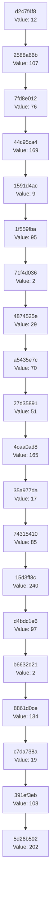

# Hash Chain Visualization

```mermaid
graph TD
    C0["5d26b592<br/>Value: 202"]
    C1["391ef3eb<br/>Value: 108"]
    C1 --> C0
    C2["c7da738a<br/>Value: 19"]
    C2 --> C1
    C3["8861d0ce<br/>Value: 134"]
    C3 --> C2
    C4["b6632d21<br/>Value: 2"]
    C4 --> C3
    C5["d4bdc1e6<br/>Value: 97"]
    C5 --> C4
    C6["15d3ff8c<br/>Value: 240"]
    C6 --> C5
    C7["74315410<br/>Value: 85"]
    C7 --> C6
    C8["35a977da<br/>Value: 17"]
    C8 --> C7
    C9["4caa0ad8<br/>Value: 165"]
    C9 --> C8
    C10["27d35891<br/>Value: 51"]
    C10 --> C9
    C11["a5435e7c<br/>Value: 70"]
    C11 --> C10
    C12["4874525e<br/>Value: 29"]
    C12 --> C11
    C13["71f4d036<br/>Value: 2"]
    C13 --> C12
    C14["1f559fba<br/>Value: 95"]
    C14 --> C13
    C15["1591d4ac<br/>Value: 9"]
    C15 --> C14
    C16["44c95ca4<br/>Value: 169"]
    C16 --> C15
    C17["7fd8e012<br/>Value: 76"]
    C17 --> C16
    C18["2588a66b<br/>Value: 107"]
    C18 --> C17
    C19["d247f4f8<br/>Value: 12"]
    C19 --> C18
```