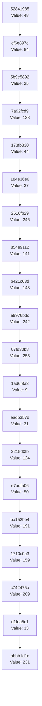

# Hash Chain Visualization

```mermaid
graph TD
    C0["abbb1d1c<br/>Value: 231"]
    C1["d1fea5c1<br/>Value: 33"]
    C1 --> C0
    C2["c742475a<br/>Value: 209"]
    C2 --> C1
    C3["1710c0a3<br/>Value: 159"]
    C3 --> C2
    C4["ba152be4<br/>Value: 191"]
    C4 --> C3
    C5["e7adfa06<br/>Value: 50"]
    C5 --> C4
    C6["2215d0fb<br/>Value: 124"]
    C6 --> C5
    C7["eadb357d<br/>Value: 31"]
    C7 --> C6
    C8["1ad6f8a3<br/>Value: 9"]
    C8 --> C7
    C9["07fd30b8<br/>Value: 255"]
    C9 --> C8
    C10["e9976bdc<br/>Value: 242"]
    C10 --> C9
    C11["b421c63d<br/>Value: 148"]
    C11 --> C10
    C12["854e9112<br/>Value: 141"]
    C12 --> C11
    C13["2516fb29<br/>Value: 246"]
    C13 --> C12
    C14["184e36e6<br/>Value: 37"]
    C14 --> C13
    C15["173fb330<br/>Value: 44"]
    C15 --> C14
    C16["7a92fcd9<br/>Value: 138"]
    C16 --> C15
    C17["5b9e5892<br/>Value: 25"]
    C17 --> C16
    C18["cf6e897c<br/>Value: 84"]
    C18 --> C17
    C19["52841985<br/>Value: 48"]
    C19 --> C18
```