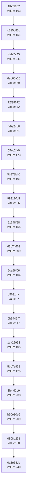

# Hash Chain Visualization

```mermaid
graph TD
    C0["0a3e64de<br/>Value: 240"]
    C1["0808b231<br/>Value: 38"]
    C1 --> C0
    C2["b50e80e6<br/>Value: 209"]
    C2 --> C1
    C3["3b4fd2b9<br/>Value: 238"]
    C3 --> C2
    C4["5bb7a938<br/>Value: 125"]
    C4 --> C3
    C5["1ca22953<br/>Value: 105"]
    C5 --> C4
    C6["0b9445f7<br/>Value: 17"]
    C6 --> C5
    C7["d56314fc<br/>Value: 7"]
    C7 --> C6
    C8["6ca66f06<br/>Value: 104"]
    C8 --> C7
    C9["63b74669<br/>Value: 209"]
    C9 --> C8
    C10["51648f98<br/>Value: 155"]
    C10 --> C9
    C11["993120d2<br/>Value: 26"]
    C11 --> C10
    C12["5b373bb0<br/>Value: 101"]
    C12 --> C11
    C13["55ec2fa0<br/>Value: 173"]
    C13 --> C12
    C14["fa9e24d8<br/>Value: 61"]
    C14 --> C13
    C15["72f38672<br/>Value: 42"]
    C15 --> C14
    C16["6eb66a10<br/>Value: 59"]
    C16 --> C15
    C17["fdde7a45<br/>Value: 241"]
    C17 --> C16
    C18["c315d83c<br/>Value: 151"]
    C18 --> C17
    C19["1fb85867<br/>Value: 163"]
    C19 --> C18
```