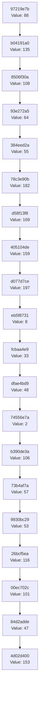

# Hash Chain Visualization

```mermaid
graph TD
    C0["4d02d400<br/>Value: 153"]
    C1["84d2adde<br/>Value: 47"]
    C1 --> C0
    C2["00ec702c<br/>Value: 101"]
    C2 --> C1
    C3["26bcf5ea<br/>Value: 116"]
    C3 --> C2
    C4["9930bc29<br/>Value: 53"]
    C4 --> C3
    C5["73b4af7a<br/>Value: 57"]
    C5 --> C4
    C6["b390de3a<br/>Value: 106"]
    C6 --> C5
    C7["74556e7a<br/>Value: 2"]
    C7 --> C6
    C8["dfae4bd9<br/>Value: 48"]
    C8 --> C7
    C9["fcbaa4e9<br/>Value: 33"]
    C9 --> C8
    C10["eb5f8731<br/>Value: 8"]
    C10 --> C9
    C11["d077d7ce<br/>Value: 197"]
    C11 --> C10
    C12["405104de<br/>Value: 159"]
    C12 --> C11
    C13["d58f13f8<br/>Value: 169"]
    C13 --> C12
    C14["78c3e90b<br/>Value: 182"]
    C14 --> C13
    C15["384eed2a<br/>Value: 55"]
    C15 --> C14
    C16["93e272a5<br/>Value: 64"]
    C16 --> C15
    C17["8506f30a<br/>Value: 108"]
    C17 --> C16
    C18["b04191a0<br/>Value: 135"]
    C18 --> C17
    C19["97219e7b<br/>Value: 88"]
    C19 --> C18
```