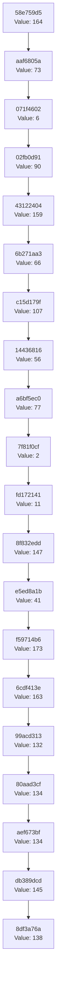

# Hash Chain Visualization

```mermaid
graph TD
    C0["8df3a76a<br/>Value: 138"]
    C1["db389dcd<br/>Value: 145"]
    C1 --> C0
    C2["aef673bf<br/>Value: 134"]
    C2 --> C1
    C3["80aad3cf<br/>Value: 134"]
    C3 --> C2
    C4["99acd313<br/>Value: 132"]
    C4 --> C3
    C5["6cdf413e<br/>Value: 163"]
    C5 --> C4
    C6["f59714b6<br/>Value: 173"]
    C6 --> C5
    C7["e5ed8a1b<br/>Value: 41"]
    C7 --> C6
    C8["8f832edd<br/>Value: 147"]
    C8 --> C7
    C9["fd172141<br/>Value: 11"]
    C9 --> C8
    C10["7f81f0cf<br/>Value: 2"]
    C10 --> C9
    C11["a6bf5ec0<br/>Value: 77"]
    C11 --> C10
    C12["14436816<br/>Value: 56"]
    C12 --> C11
    C13["c15d179f<br/>Value: 107"]
    C13 --> C12
    C14["6b271aa3<br/>Value: 66"]
    C14 --> C13
    C15["43122404<br/>Value: 159"]
    C15 --> C14
    C16["02fb0d91<br/>Value: 90"]
    C16 --> C15
    C17["071f4602<br/>Value: 6"]
    C17 --> C16
    C18["aaf6805a<br/>Value: 73"]
    C18 --> C17
    C19["58e759d5<br/>Value: 164"]
    C19 --> C18
```