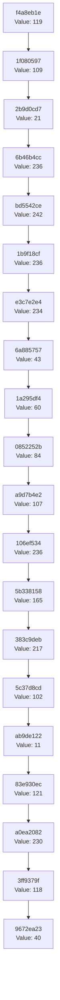

# Hash Chain Visualization

```mermaid
graph TD
    C0["9672ea23<br/>Value: 40"]
    C1["3ff9379f<br/>Value: 118"]
    C1 --> C0
    C2["a0ea2082<br/>Value: 230"]
    C2 --> C1
    C3["83e930ec<br/>Value: 121"]
    C3 --> C2
    C4["ab9de122<br/>Value: 11"]
    C4 --> C3
    C5["5c37d8cd<br/>Value: 102"]
    C5 --> C4
    C6["383c9deb<br/>Value: 217"]
    C6 --> C5
    C7["5b338158<br/>Value: 165"]
    C7 --> C6
    C8["106ef534<br/>Value: 236"]
    C8 --> C7
    C9["a9d7b4e2<br/>Value: 107"]
    C9 --> C8
    C10["0852252b<br/>Value: 84"]
    C10 --> C9
    C11["1a295df4<br/>Value: 60"]
    C11 --> C10
    C12["6a885757<br/>Value: 43"]
    C12 --> C11
    C13["e3c7e2e4<br/>Value: 234"]
    C13 --> C12
    C14["1b9f18cf<br/>Value: 236"]
    C14 --> C13
    C15["bd5542ce<br/>Value: 242"]
    C15 --> C14
    C16["6b46b4cc<br/>Value: 236"]
    C16 --> C15
    C17["2b9d0cd7<br/>Value: 21"]
    C17 --> C16
    C18["1f080597<br/>Value: 109"]
    C18 --> C17
    C19["f4a8eb1e<br/>Value: 119"]
    C19 --> C18
```