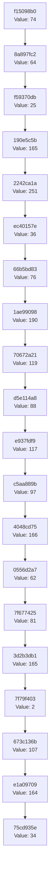

# Hash Chain Visualization

```mermaid
graph TD
    C0["75cd935e<br/>Value: 34"]
    C1["e1a09709<br/>Value: 164"]
    C1 --> C0
    C2["673c136b<br/>Value: 107"]
    C2 --> C1
    C3["7f79f403<br/>Value: 2"]
    C3 --> C2
    C4["3d2b3db1<br/>Value: 165"]
    C4 --> C3
    C5["7f677425<br/>Value: 81"]
    C5 --> C4
    C6["0556d2a7<br/>Value: 62"]
    C6 --> C5
    C7["4048cd75<br/>Value: 166"]
    C7 --> C6
    C8["c5aa889b<br/>Value: 97"]
    C8 --> C7
    C9["e937fdf9<br/>Value: 117"]
    C9 --> C8
    C10["d5e114a8<br/>Value: 88"]
    C10 --> C9
    C11["70672a21<br/>Value: 119"]
    C11 --> C10
    C12["1ae99098<br/>Value: 190"]
    C12 --> C11
    C13["66b5bd83<br/>Value: 76"]
    C13 --> C12
    C14["ec40157e<br/>Value: 36"]
    C14 --> C13
    C15["2242ca1a<br/>Value: 251"]
    C15 --> C14
    C16["190e5c5b<br/>Value: 165"]
    C16 --> C15
    C17["f59370db<br/>Value: 25"]
    C17 --> C16
    C18["8a897fc2<br/>Value: 64"]
    C18 --> C17
    C19["f15098b0<br/>Value: 74"]
    C19 --> C18
```