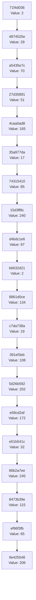

# Hash Chain Visualization

```mermaid
graph TD
    C0["9e425548<br/>Value: 206"]
    C1["ef96f3fb<br/>Value: 65"]
    C1 --> C0
    C2["8473b39e<br/>Value: 115"]
    C2 --> C1
    C3["86b2a7ee<br/>Value: 245"]
    C3 --> C2
    C4["e51b541c<br/>Value: 32"]
    C4 --> C3
    C5["e58cd2af<br/>Value: 172"]
    C5 --> C4
    C6["5d26b592<br/>Value: 202"]
    C6 --> C5
    C7["391ef3eb<br/>Value: 108"]
    C7 --> C6
    C8["c7da738a<br/>Value: 19"]
    C8 --> C7
    C9["8861d0ce<br/>Value: 134"]
    C9 --> C8
    C10["b6632d21<br/>Value: 2"]
    C10 --> C9
    C11["d4bdc1e6<br/>Value: 97"]
    C11 --> C10
    C12["15d3ff8c<br/>Value: 240"]
    C12 --> C11
    C13["74315410<br/>Value: 85"]
    C13 --> C12
    C14["35a977da<br/>Value: 17"]
    C14 --> C13
    C15["4caa0ad8<br/>Value: 165"]
    C15 --> C14
    C16["27d35891<br/>Value: 51"]
    C16 --> C15
    C17["a5435e7c<br/>Value: 70"]
    C17 --> C16
    C18["4874525e<br/>Value: 29"]
    C18 --> C17
    C19["71f4d036<br/>Value: 2"]
    C19 --> C18
```