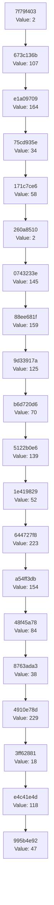

# Hash Chain Visualization

```mermaid
graph TD
    C0["995b4e92<br/>Value: 47"]
    C1["e4c41e4d<br/>Value: 118"]
    C1 --> C0
    C2["3ff62881<br/>Value: 18"]
    C2 --> C1
    C3["4910e78d<br/>Value: 229"]
    C3 --> C2
    C4["8763ada3<br/>Value: 38"]
    C4 --> C3
    C5["48f45a78<br/>Value: 84"]
    C5 --> C4
    C6["a54ff3db<br/>Value: 154"]
    C6 --> C5
    C7["644727f8<br/>Value: 223"]
    C7 --> C6
    C8["1e419829<br/>Value: 52"]
    C8 --> C7
    C9["5122b0e6<br/>Value: 139"]
    C9 --> C8
    C10["b6d720d6<br/>Value: 70"]
    C10 --> C9
    C11["9d33917a<br/>Value: 125"]
    C11 --> C10
    C12["88ee681f<br/>Value: 159"]
    C12 --> C11
    C13["0743233e<br/>Value: 145"]
    C13 --> C12
    C14["260a8510<br/>Value: 2"]
    C14 --> C13
    C15["171c7ce6<br/>Value: 58"]
    C15 --> C14
    C16["75cd935e<br/>Value: 34"]
    C16 --> C15
    C17["e1a09709<br/>Value: 164"]
    C17 --> C16
    C18["673c136b<br/>Value: 107"]
    C18 --> C17
    C19["7f79f403<br/>Value: 2"]
    C19 --> C18
```