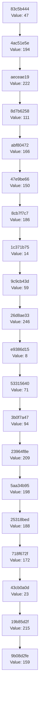

# Hash Chain Visualization

```mermaid
graph TD
    C0["9b08d2fe<br/>Value: 159"]
    C1["19b85d2f<br/>Value: 215"]
    C1 --> C0
    C2["43cb0a0d<br/>Value: 23"]
    C2 --> C1
    C3["718f672f<br/>Value: 172"]
    C3 --> C2
    C4["25318bed<br/>Value: 188"]
    C4 --> C3
    C5["5aa34b95<br/>Value: 198"]
    C5 --> C4
    C6["23964f8e<br/>Value: 209"]
    C6 --> C5
    C7["3b0f7a47<br/>Value: 94"]
    C7 --> C6
    C8["53315640<br/>Value: 71"]
    C8 --> C7
    C9["e9386d15<br/>Value: 8"]
    C9 --> C8
    C10["26d8ae33<br/>Value: 246"]
    C10 --> C9
    C11["9c9cb43d<br/>Value: 59"]
    C11 --> C10
    C12["1c371b75<br/>Value: 14"]
    C12 --> C11
    C13["8cb7f7c7<br/>Value: 186"]
    C13 --> C12
    C14["47e9be66<br/>Value: 150"]
    C14 --> C13
    C15["abf80472<br/>Value: 166"]
    C15 --> C14
    C16["8d7b6258<br/>Value: 111"]
    C16 --> C15
    C17["aeceae19<br/>Value: 222"]
    C17 --> C16
    C18["4ac51e5e<br/>Value: 194"]
    C18 --> C17
    C19["83c5b444<br/>Value: 47"]
    C19 --> C18
```