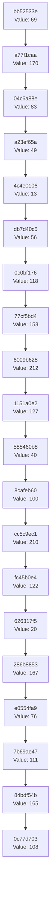

# Hash Chain Visualization

```mermaid
graph TD
    C0["0c77d703<br/>Value: 108"]
    C1["84bdf54b<br/>Value: 165"]
    C1 --> C0
    C2["7b69ae47<br/>Value: 111"]
    C2 --> C1
    C3["e0554fa9<br/>Value: 76"]
    C3 --> C2
    C4["286b8853<br/>Value: 167"]
    C4 --> C3
    C5["626317f5<br/>Value: 20"]
    C5 --> C4
    C6["fc45b0e4<br/>Value: 122"]
    C6 --> C5
    C7["cc5c9ec1<br/>Value: 210"]
    C7 --> C6
    C8["8cafeb60<br/>Value: 100"]
    C8 --> C7
    C9["585460b8<br/>Value: 40"]
    C9 --> C8
    C10["1151a0e2<br/>Value: 127"]
    C10 --> C9
    C11["6009b628<br/>Value: 212"]
    C11 --> C10
    C12["77cf5bd4<br/>Value: 153"]
    C12 --> C11
    C13["0c0bf176<br/>Value: 118"]
    C13 --> C12
    C14["db7d40c5<br/>Value: 56"]
    C14 --> C13
    C15["4c4e0106<br/>Value: 13"]
    C15 --> C14
    C16["a23ef65a<br/>Value: 49"]
    C16 --> C15
    C17["04c6a88e<br/>Value: 83"]
    C17 --> C16
    C18["a77f1caa<br/>Value: 170"]
    C18 --> C17
    C19["bb52533e<br/>Value: 69"]
    C19 --> C18
```