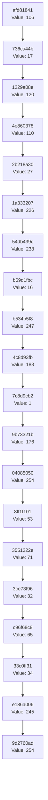

# Hash Chain Visualization

```mermaid
graph TD
    C0["9d2760ad<br/>Value: 254"]
    C1["e186a006<br/>Value: 245"]
    C1 --> C0
    C2["33c0ff31<br/>Value: 34"]
    C2 --> C1
    C3["c96f68c8<br/>Value: 65"]
    C3 --> C2
    C4["3ce73f96<br/>Value: 32"]
    C4 --> C3
    C5["3551222e<br/>Value: 71"]
    C5 --> C4
    C6["8ff1f101<br/>Value: 53"]
    C6 --> C5
    C7["04085050<br/>Value: 254"]
    C7 --> C6
    C8["9b73321b<br/>Value: 176"]
    C8 --> C7
    C9["7c8d9cb2<br/>Value: 1"]
    C9 --> C8
    C10["4c8d93fb<br/>Value: 183"]
    C10 --> C9
    C11["b534b5f8<br/>Value: 247"]
    C11 --> C10
    C12["b69d1fbc<br/>Value: 16"]
    C12 --> C11
    C13["54db439c<br/>Value: 238"]
    C13 --> C12
    C14["1a333207<br/>Value: 226"]
    C14 --> C13
    C15["2b218a30<br/>Value: 27"]
    C15 --> C14
    C16["4e860378<br/>Value: 110"]
    C16 --> C15
    C17["1229a08e<br/>Value: 120"]
    C17 --> C16
    C18["736ca44b<br/>Value: 17"]
    C18 --> C17
    C19["afd81841<br/>Value: 106"]
    C19 --> C18
```