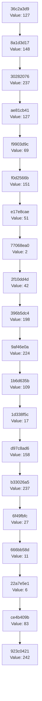

# Hash Chain Visualization

```mermaid
graph TD
    C0["923c0421<br/>Value: 242"]
    C1["ce4b409b<br/>Value: 83"]
    C1 --> C0
    C2["22a7e5e1<br/>Value: 6"]
    C2 --> C1
    C3["666bb58d<br/>Value: 11"]
    C3 --> C2
    C4["6f49fbfc<br/>Value: 27"]
    C4 --> C3
    C5["b33026a5<br/>Value: 237"]
    C5 --> C4
    C6["d97c8ad6<br/>Value: 158"]
    C6 --> C5
    C7["1d338f5c<br/>Value: 17"]
    C7 --> C6
    C8["1b6d635b<br/>Value: 109"]
    C8 --> C7
    C9["9af46e0a<br/>Value: 224"]
    C9 --> C8
    C10["396b5dc4<br/>Value: 198"]
    C10 --> C9
    C11["2f10dd4d<br/>Value: 42"]
    C11 --> C10
    C12["77068ea0<br/>Value: 2"]
    C12 --> C11
    C13["e17e8cae<br/>Value: 51"]
    C13 --> C12
    C14["f0d2566b<br/>Value: 151"]
    C14 --> C13
    C15["f9903d9c<br/>Value: 69"]
    C15 --> C14
    C16["ae81cb41<br/>Value: 127"]
    C16 --> C15
    C17["30282076<br/>Value: 237"]
    C17 --> C16
    C18["8a1d3d17<br/>Value: 148"]
    C18 --> C17
    C19["36c2a3d9<br/>Value: 127"]
    C19 --> C18
```