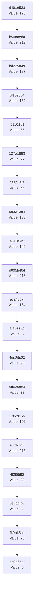

# Hash Chain Visualization

```mermaid
graph TD
    C0["ce0a65af<br/>Value: 8"]
    C1["f69b65cc<br/>Value: 73"]
    C1 --> C0
    C2["e2d20f9a<br/>Value: 35"]
    C2 --> C1
    C3["4f2f8592<br/>Value: 88"]
    C3 --> C2
    C4["a5fd9bc0<br/>Value: 218"]
    C4 --> C3
    C5["5c0c9cb6<br/>Value: 192"]
    C5 --> C4
    C6["9d035d54<br/>Value: 38"]
    C6 --> C5
    C7["4ee29c23<br/>Value: 98"]
    C7 --> C6
    C8["5f5e83a9<br/>Value: 3"]
    C8 --> C7
    C9["eca4bc7f<br/>Value: 164"]
    C9 --> C8
    C10["d005b40d<br/>Value: 218"]
    C10 --> C9
    C11["4618a9cf<br/>Value: 140"]
    C11 --> C10
    C12["993313a4<br/>Value: 188"]
    C12 --> C11
    C13["2552c5f6<br/>Value: 44"]
    C13 --> C12
    C14["127a1893<br/>Value: 77"]
    C14 --> C13
    C15["f6101161<br/>Value: 38"]
    C15 --> C14
    C16["0fe59664<br/>Value: 162"]
    C16 --> C15
    C17["bd225a49<br/>Value: 187"]
    C17 --> C16
    C18["b50a8eda<br/>Value: 219"]
    C18 --> C17
    C19["64919523<br/>Value: 178"]
    C19 --> C18
```