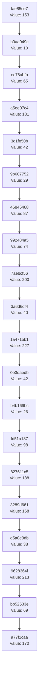

# Hash Chain Visualization

```mermaid
graph TD
    C0["a77f1caa<br/>Value: 170"]
    C1["bb52533e<br/>Value: 69"]
    C1 --> C0
    C2["9628364f<br/>Value: 213"]
    C2 --> C1
    C3["d5a0e9db<br/>Value: 38"]
    C3 --> C2
    C4["3289d661<br/>Value: 168"]
    C4 --> C3
    C5["827611c5<br/>Value: 188"]
    C5 --> C4
    C6["fd51a187<br/>Value: 98"]
    C6 --> C5
    C7["b4b169bc<br/>Value: 26"]
    C7 --> C6
    C8["0e3daedb<br/>Value: 42"]
    C8 --> C7
    C9["1a471bb1<br/>Value: 227"]
    C9 --> C8
    C10["3a6d6df4<br/>Value: 40"]
    C10 --> C9
    C11["7aebcf56<br/>Value: 200"]
    C11 --> C10
    C12["992484a5<br/>Value: 74"]
    C12 --> C11
    C13["46845468<br/>Value: 87"]
    C13 --> C12
    C14["9b607752<br/>Value: 29"]
    C14 --> C13
    C15["3d1fe50b<br/>Value: 42"]
    C15 --> C14
    C16["a5ee07c4<br/>Value: 181"]
    C16 --> C15
    C17["ec76abfb<br/>Value: 65"]
    C17 --> C16
    C18["b0aa049c<br/>Value: 10"]
    C18 --> C17
    C19["fae85ce7<br/>Value: 153"]
    C19 --> C18
```