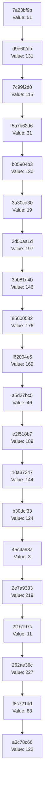

# Hash Chain Visualization

```mermaid
graph TD
    C0["a3c78c66<br/>Value: 122"]
    C1["f8c721dd<br/>Value: 83"]
    C1 --> C0
    C2["262ae36c<br/>Value: 227"]
    C2 --> C1
    C3["2f16197c<br/>Value: 11"]
    C3 --> C2
    C4["2e7a9333<br/>Value: 219"]
    C4 --> C3
    C5["45c4a93a<br/>Value: 3"]
    C5 --> C4
    C6["b30dcf33<br/>Value: 124"]
    C6 --> C5
    C7["10a37347<br/>Value: 144"]
    C7 --> C6
    C8["e2f518b7<br/>Value: 189"]
    C8 --> C7
    C9["a5d37bc5<br/>Value: 46"]
    C9 --> C8
    C10["f62004e5<br/>Value: 169"]
    C10 --> C9
    C11["85600582<br/>Value: 176"]
    C11 --> C10
    C12["3bb81d4b<br/>Value: 146"]
    C12 --> C11
    C13["2d50aa1d<br/>Value: 197"]
    C13 --> C12
    C14["3a30cd30<br/>Value: 19"]
    C14 --> C13
    C15["b05904b3<br/>Value: 130"]
    C15 --> C14
    C16["5a7b62d6<br/>Value: 31"]
    C16 --> C15
    C17["7c99f2d8<br/>Value: 115"]
    C17 --> C16
    C18["d9e6f2db<br/>Value: 131"]
    C18 --> C17
    C19["7a23bf9b<br/>Value: 51"]
    C19 --> C18
```