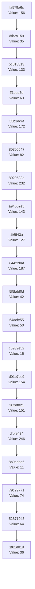

# Hash Chain Visualization

```mermaid
graph TD
    C0["1f01d819<br/>Value: 36"]
    C1["52871043<br/>Value: 64"]
    C1 --> C0
    C2["79c29771<br/>Value: 74"]
    C2 --> C1
    C3["8b9adae6<br/>Value: 11"]
    C3 --> C2
    C4["dfbfe434<br/>Value: 246"]
    C4 --> C3
    C5["262df821<br/>Value: 151"]
    C5 --> C4
    C6["d01e7bc9<br/>Value: 154"]
    C6 --> C5
    C7["c5939e52<br/>Value: 15"]
    C7 --> C6
    C8["64acfe55<br/>Value: 50"]
    C8 --> C7
    C9["5f5bdd0d<br/>Value: 42"]
    C9 --> C8
    C10["64422baf<br/>Value: 187"]
    C10 --> C9
    C11["1f6ff43a<br/>Value: 127"]
    C11 --> C10
    C12["a94662e3<br/>Value: 143"]
    C12 --> C11
    C13["8029523e<br/>Value: 232"]
    C13 --> C12
    C14["80306547<br/>Value: 82"]
    C14 --> C13
    C15["33b1dc4f<br/>Value: 172"]
    C15 --> C14
    C16["ff1bea7d<br/>Value: 63"]
    C16 --> C15
    C17["5c813313<br/>Value: 133"]
    C17 --> C16
    C18["dfb29159<br/>Value: 35"]
    C18 --> C17
    C19["fa579a6c<br/>Value: 156"]
    C19 --> C18
```