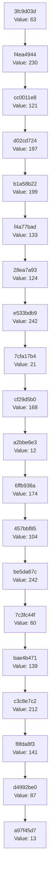

# Hash Chain Visualization

```mermaid
graph TD
    C0["a97f45d7<br/>Value: 13"]
    C1["d4992be0<br/>Value: 87"]
    C1 --> C0
    C2["f8fda8f3<br/>Value: 141"]
    C2 --> C1
    C3["c3c8e7c2<br/>Value: 212"]
    C3 --> C2
    C4["bae4b471<br/>Value: 139"]
    C4 --> C3
    C5["7c3fc44f<br/>Value: 60"]
    C5 --> C4
    C6["be5da67c<br/>Value: 242"]
    C6 --> C5
    C7["457bbf85<br/>Value: 104"]
    C7 --> C6
    C8["6ffb936a<br/>Value: 174"]
    C8 --> C7
    C9["a2bbe6e3<br/>Value: 12"]
    C9 --> C8
    C10["cf29d5b0<br/>Value: 168"]
    C10 --> C9
    C11["7cfa17b4<br/>Value: 21"]
    C11 --> C10
    C12["e533bdb9<br/>Value: 242"]
    C12 --> C11
    C13["28ea7a93<br/>Value: 124"]
    C13 --> C12
    C14["f4a77bad<br/>Value: 133"]
    C14 --> C13
    C15["b1a58b22<br/>Value: 199"]
    C15 --> C14
    C16["d02cd724<br/>Value: 197"]
    C16 --> C15
    C17["cc0011e8<br/>Value: 121"]
    C17 --> C16
    C18["f4ea4944<br/>Value: 230"]
    C18 --> C17
    C19["3fc9d03d<br/>Value: 63"]
    C19 --> C18
```