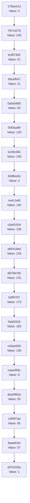

# Hash Chain Visualization

```mermaid
graph TD
    C0["d57b226e<br/>Value: 1"]
    C1["8aae91fe<br/>Value: 57"]
    C1 --> C0
    C2["c095f7ad<br/>Value: 65"]
    C2 --> C1
    C3["daa3962a<br/>Value: 20"]
    C3 --> C2
    C4["caea369c<br/>Value: 9"]
    C4 --> C3
    C5["c46ae506<br/>Value: 136"]
    C5 --> C4
    C6["5daf2d16<br/>Value: 182"]
    C6 --> C5
    C7["b2ff4757<br/>Value: 172"]
    C7 --> C6
    C8["967b87d5<br/>Value: 231"]
    C8 --> C7
    C9["a85418ed<br/>Value: 226"]
    C9 --> C8
    C10["c0e81004<br/>Value: 136"]
    C10 --> C9
    C11["ce4c1ebf<br/>Value: 140"]
    C11 --> C10
    C12["40d9ee5c<br/>Value: 4"]
    C12 --> C11
    C13["1e49c381<br/>Value: 246"]
    C13 --> C12
    C14["00f3aa99<br/>Value: 129"]
    C14 --> C13
    C15["0a6a5680<br/>Value: 63"]
    C15 --> C14
    C16["9dcef047<br/>Value: 11"]
    C16 --> C15
    C17["bc8f7465<br/>Value: 51"]
    C17 --> C16
    C18["787c4276<br/>Value: 245"]
    C18 --> C17
    C19["178ee412<br/>Value: 0"]
    C19 --> C18
```