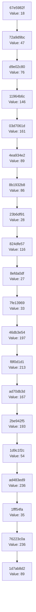

# Hash Chain Visualization

```mermaid
graph TD
    C0["1d7ab8d2<br/>Value: 89"]
    C1["76223c0a<br/>Value: 236"]
    C1 --> C0
    C2["1fff54fa<br/>Value: 35"]
    C2 --> C1
    C3["ad483ed9<br/>Value: 236"]
    C3 --> C2
    C4["1d9c1f2c<br/>Value: 54"]
    C4 --> C3
    C5["2be942f5<br/>Value: 193"]
    C5 --> C4
    C6["ad70db3d<br/>Value: 167"]
    C6 --> C5
    C7["f8f0d1d1<br/>Value: 213"]
    C7 --> C6
    C8["46db3e54<br/>Value: 197"]
    C8 --> C7
    C9["7fe13969<br/>Value: 33"]
    C9 --> C8
    C10["8efda0df<br/>Value: 27"]
    C10 --> C9
    C11["824dfe57<br/>Value: 116"]
    C11 --> C10
    C12["23b6df91<br/>Value: 28"]
    C12 --> C11
    C13["8b1932b8<br/>Value: 86"]
    C13 --> C12
    C14["4ea934e2<br/>Value: 89"]
    C14 --> C13
    C15["03d7061d<br/>Value: 161"]
    C15 --> C14
    C16["11964b6c<br/>Value: 146"]
    C16 --> C15
    C17["d9e02c80<br/>Value: 76"]
    C17 --> C16
    C18["72a9d9bc<br/>Value: 47"]
    C18 --> C17
    C19["67e5982f<br/>Value: 18"]
    C19 --> C18
```