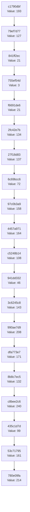

# Hash Chain Visualization

```mermaid
graph TD
    C0["780e09fa<br/>Value: 214"]
    C1["53c71795<br/>Value: 161"]
    C1 --> C0
    C2["435c1d7d<br/>Value: 99"]
    C2 --> C1
    C3["c8bee2c6<br/>Value: 240"]
    C3 --> C2
    C4["8b8c7ec5<br/>Value: 132"]
    C4 --> C3
    C5["dfa773e7<br/>Value: 171"]
    C5 --> C4
    C6["990ae7d9<br/>Value: 208"]
    C6 --> C5
    C7["3c6245c8<br/>Value: 143"]
    C7 --> C6
    C8["941dd332<br/>Value: 46"]
    C8 --> C7
    C9["c5248b14<br/>Value: 108"]
    C9 --> C8
    C10["4457a971<br/>Value: 164"]
    C10 --> C9
    C11["97c0b3a9<br/>Value: 158"]
    C11 --> C10
    C12["6c69bcc6<br/>Value: 72"]
    C12 --> C11
    C13["27f18d83<br/>Value: 137"]
    C13 --> C12
    C14["2fc42e7b<br/>Value: 134"]
    C14 --> C13
    C15["f6691de6<br/>Value: 21"]
    C15 --> C14
    C16["755ef54d<br/>Value: 3"]
    C16 --> C15
    C17["841ff2ec<br/>Value: 21"]
    C17 --> C16
    C18["79ef7d77<br/>Value: 127"]
    C18 --> C17
    C19["c1790dbf<br/>Value: 193"]
    C19 --> C18
```