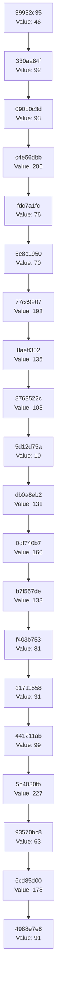

# Hash Chain Visualization

```mermaid
graph TD
    C0["4988e7e8<br/>Value: 91"]
    C1["6cd85d00<br/>Value: 178"]
    C1 --> C0
    C2["93570bc8<br/>Value: 63"]
    C2 --> C1
    C3["5b4030fb<br/>Value: 227"]
    C3 --> C2
    C4["441211ab<br/>Value: 99"]
    C4 --> C3
    C5["d1711558<br/>Value: 31"]
    C5 --> C4
    C6["f403b753<br/>Value: 81"]
    C6 --> C5
    C7["b7f557de<br/>Value: 133"]
    C7 --> C6
    C8["0df740b7<br/>Value: 160"]
    C8 --> C7
    C9["db0a8eb2<br/>Value: 131"]
    C9 --> C8
    C10["5d12d75a<br/>Value: 10"]
    C10 --> C9
    C11["8763522c<br/>Value: 103"]
    C11 --> C10
    C12["8aeff302<br/>Value: 135"]
    C12 --> C11
    C13["77cc9907<br/>Value: 193"]
    C13 --> C12
    C14["5e8c1950<br/>Value: 70"]
    C14 --> C13
    C15["fdc7a1fc<br/>Value: 76"]
    C15 --> C14
    C16["c4e56dbb<br/>Value: 206"]
    C16 --> C15
    C17["090b0c3d<br/>Value: 93"]
    C17 --> C16
    C18["330aa84f<br/>Value: 92"]
    C18 --> C17
    C19["39932c35<br/>Value: 46"]
    C19 --> C18
```