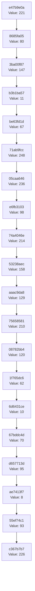

# Hash Chain Visualization

```mermaid
graph TD
    C0["c367b7b7<br/>Value: 226"]
    C1["55ef74c1<br/>Value: 93"]
    C1 --> C0
    C2["ae7413f7<br/>Value: 8"]
    C2 --> C1
    C3["d657713d<br/>Value: 95"]
    C3 --> C2
    C4["67bddc4d<br/>Value: 70"]
    C4 --> C3
    C5["6d6431ce<br/>Value: 10"]
    C5 --> C4
    C6["1f765dc6<br/>Value: 62"]
    C6 --> C5
    C7["08782bb4<br/>Value: 120"]
    C7 --> C6
    C8["75658581<br/>Value: 210"]
    C8 --> C7
    C9["aaac9da8<br/>Value: 129"]
    C9 --> C8
    C10["53238aec<br/>Value: 158"]
    C10 --> C9
    C11["74a4046e<br/>Value: 214"]
    C11 --> C10
    C12["e6fb3103<br/>Value: 98"]
    C12 --> C11
    C13["05caa646<br/>Value: 236"]
    C13 --> C12
    C14["71ab9fcc<br/>Value: 248"]
    C14 --> C13
    C15["be63fd1d<br/>Value: 67"]
    C15 --> C14
    C16["b3b1ba57<br/>Value: 11"]
    C16 --> C15
    C17["3ba00f87<br/>Value: 147"]
    C17 --> C16
    C18["8685fa05<br/>Value: 80"]
    C18 --> C17
    C19["e47b9e0a<br/>Value: 221"]
    C19 --> C18
```