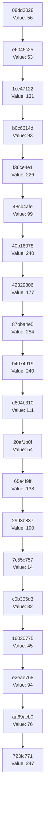

# Hash Chain Visualization

```mermaid
graph TD
    C0["723fc771<br/>Value: 247"]
    C1["aa69acb0<br/>Value: 76"]
    C1 --> C0
    C2["e2eae768<br/>Value: 94"]
    C2 --> C1
    C3["16030775<br/>Value: 45"]
    C3 --> C2
    C4["c0b305d3<br/>Value: 82"]
    C4 --> C3
    C5["7c55c757<br/>Value: 14"]
    C5 --> C4
    C6["2993b837<br/>Value: 190"]
    C6 --> C5
    C7["65e4f9ff<br/>Value: 138"]
    C7 --> C6
    C8["20af1b0f<br/>Value: 54"]
    C8 --> C7
    C9["d604b310<br/>Value: 111"]
    C9 --> C8
    C10["b4074919<br/>Value: 240"]
    C10 --> C9
    C11["87bba4e5<br/>Value: 254"]
    C11 --> C10
    C12["42329806<br/>Value: 177"]
    C12 --> C11
    C13["40b16078<br/>Value: 240"]
    C13 --> C12
    C14["48cb4afe<br/>Value: 99"]
    C14 --> C13
    C15["f36ce4e1<br/>Value: 226"]
    C15 --> C14
    C16["b0c6614d<br/>Value: 93"]
    C16 --> C15
    C17["1ce47122<br/>Value: 131"]
    C17 --> C16
    C18["e6045c25<br/>Value: 53"]
    C18 --> C17
    C19["08dd2028<br/>Value: 56"]
    C19 --> C18
```