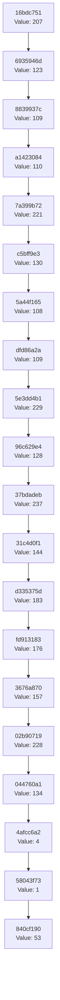

# Hash Chain Visualization

```mermaid
graph TD
    C0["840cf190<br/>Value: 53"]
    C1["58043f73<br/>Value: 1"]
    C1 --> C0
    C2["4afcc6a2<br/>Value: 4"]
    C2 --> C1
    C3["044760a1<br/>Value: 134"]
    C3 --> C2
    C4["02b90719<br/>Value: 228"]
    C4 --> C3
    C5["3676a870<br/>Value: 157"]
    C5 --> C4
    C6["fd913183<br/>Value: 176"]
    C6 --> C5
    C7["d335375d<br/>Value: 183"]
    C7 --> C6
    C8["31c4d0f1<br/>Value: 144"]
    C8 --> C7
    C9["37bdadeb<br/>Value: 237"]
    C9 --> C8
    C10["96c629e4<br/>Value: 128"]
    C10 --> C9
    C11["5e3dd4b1<br/>Value: 229"]
    C11 --> C10
    C12["dfd86a2a<br/>Value: 109"]
    C12 --> C11
    C13["5a44f165<br/>Value: 108"]
    C13 --> C12
    C14["c5bff9e3<br/>Value: 130"]
    C14 --> C13
    C15["7a399b72<br/>Value: 221"]
    C15 --> C14
    C16["a1423084<br/>Value: 110"]
    C16 --> C15
    C17["8839937c<br/>Value: 109"]
    C17 --> C16
    C18["6935946d<br/>Value: 123"]
    C18 --> C17
    C19["16bdc751<br/>Value: 207"]
    C19 --> C18
```