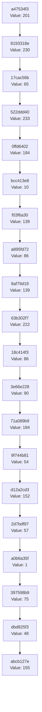

# Hash Chain Visualization

```mermaid
graph TD
    C0["abcb127e<br/>Value: 155"]
    C1["dbd825f3<br/>Value: 48"]
    C1 --> C0
    C2["397598b9<br/>Value: 75"]
    C2 --> C1
    C3["a0b6a35f<br/>Value: 1"]
    C3 --> C2
    C4["2d7bdf97<br/>Value: 57"]
    C4 --> C3
    C5["d12a2cd3<br/>Value: 152"]
    C5 --> C4
    C6["9f744b81<br/>Value: 54"]
    C6 --> C5
    C7["71a089b9<br/>Value: 184"]
    C7 --> C6
    C8["3e66e228<br/>Value: 90"]
    C8 --> C7
    C9["18c414f3<br/>Value: 86"]
    C9 --> C8
    C10["63b302f7<br/>Value: 222"]
    C10 --> C9
    C11["8af79d19<br/>Value: 139"]
    C11 --> C10
    C12["a895fd72<br/>Value: 86"]
    C12 --> C11
    C13["f03f6a30<br/>Value: 139"]
    C13 --> C12
    C14["bcc413e8<br/>Value: 10"]
    C14 --> C13
    C15["0ffd6402<br/>Value: 184"]
    C15 --> C14
    C16["522ddd40<br/>Value: 233"]
    C16 --> C15
    C17["17cac56b<br/>Value: 65"]
    C17 --> C16
    C18["8193318e<br/>Value: 230"]
    C18 --> C17
    C19["a47534f3<br/>Value: 201"]
    C19 --> C18
```