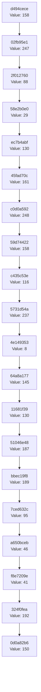

# Hash Chain Visualization

```mermaid
graph TD
    C0["0d0a82b6<br/>Value: 150"]
    C1["324f0fea<br/>Value: 192"]
    C1 --> C0
    C2["f8e7209e<br/>Value: 41"]
    C2 --> C1
    C3["a650bceb<br/>Value: 46"]
    C3 --> C2
    C4["7ced632c<br/>Value: 95"]
    C4 --> C3
    C5["bbec19f8<br/>Value: 189"]
    C5 --> C4
    C6["51046e48<br/>Value: 187"]
    C6 --> C5
    C7["11681f39<br/>Value: 130"]
    C7 --> C6
    C8["64a8a177<br/>Value: 145"]
    C8 --> C7
    C9["4e149353<br/>Value: 8"]
    C9 --> C8
    C10["5731d54a<br/>Value: 237"]
    C10 --> C9
    C11["c435c53e<br/>Value: 116"]
    C11 --> C10
    C12["59d74422<br/>Value: 158"]
    C12 --> C11
    C13["c0d0a592<br/>Value: 248"]
    C13 --> C12
    C14["45fad70c<br/>Value: 161"]
    C14 --> C13
    C15["ec7b4abf<br/>Value: 130"]
    C15 --> C14
    C16["58e2b0e0<br/>Value: 29"]
    C16 --> C15
    C17["2f012760<br/>Value: 88"]
    C17 --> C16
    C18["02fb95e1<br/>Value: 247"]
    C18 --> C17
    C19["d494cece<br/>Value: 158"]
    C19 --> C18
```