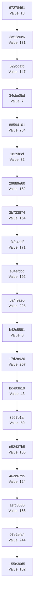

# Hash Chain Visualization

```mermaid
graph TD
    C0["155e30d5<br/>Value: 162"]
    C1["07e2efa4<br/>Value: 244"]
    C1 --> C0
    C2["aefd3636<br/>Value: 156"]
    C2 --> C1
    C3["462e6795<br/>Value: 124"]
    C3 --> C2
    C4["e52437b5<br/>Value: 105"]
    C4 --> C3
    C5["3967b1af<br/>Value: 59"]
    C5 --> C4
    C6["bc493b19<br/>Value: 43"]
    C6 --> C5
    C7["17d2a920<br/>Value: 207"]
    C7 --> C6
    C8["b42c5581<br/>Value: 0"]
    C8 --> C7
    C9["6a4f9ae5<br/>Value: 226"]
    C9 --> C8
    C10["e84efdcd<br/>Value: 192"]
    C10 --> C9
    C11["f4fe4ddf<br/>Value: 171"]
    C11 --> C10
    C12["3b733874<br/>Value: 154"]
    C12 --> C11
    C13["29689e60<br/>Value: 162"]
    C13 --> C12
    C14["1829f8cf<br/>Value: 32"]
    C14 --> C13
    C15["88594101<br/>Value: 234"]
    C15 --> C14
    C16["34cbe0bd<br/>Value: 7"]
    C16 --> C15
    C17["629cdafd<br/>Value: 147"]
    C17 --> C16
    C18["3a52c0c6<br/>Value: 131"]
    C18 --> C17
    C19["67278461<br/>Value: 13"]
    C19 --> C18
```