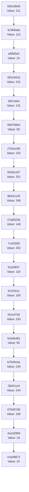

# Hash Chain Visualization

```mermaid
graph TD
    C0["e1b48872<br/>Value: 24"]
    C1["4a1d28b9<br/>Value: 19"]
    C1 --> C0
    C2["070d07d6<br/>Value: 166"]
    C2 --> C1
    C3["26d21cef<br/>Value: 244"]
    C3 --> C2
    C4["b7540cba<br/>Value: 239"]
    C4 --> C3
    C5["52e6b481<br/>Value: 95"]
    C5 --> C4
    C6["f41e4728<br/>Value: 243"]
    C6 --> C5
    C7["912f161c<br/>Value: 160"]
    C7 --> C6
    C8["5cb29f37<br/>Value: 116"]
    C8 --> C7
    C9["7c45356f<br/>Value: 202"]
    C9 --> C8
    C10["27a8923b<br/>Value: 146"]
    C10 --> C9
    C11["9844c145<br/>Value: 248"]
    C11 --> C10
    C12["5928c437<br/>Value: 251"]
    C12 --> C11
    C13["27b2a186<br/>Value: 232"]
    C13 --> C12
    C14["069789e0<br/>Value: 69"]
    C14 --> C13
    C15["f467d4ef<br/>Value: 131"]
    C15 --> C14
    C16["062c941d<br/>Value: 231"]
    C16 --> C15
    C17["a5ffd5e0<br/>Value: 24"]
    C17 --> C16
    C18["3c3b9a6a<br/>Value: 110"]
    C18 --> C17
    C19["6e61d0e8<br/>Value: 211"]
    C19 --> C18
```