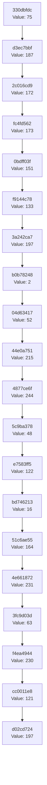

# Hash Chain Visualization

```mermaid
graph TD
    C0["d02cd724<br/>Value: 197"]
    C1["cc0011e8<br/>Value: 121"]
    C1 --> C0
    C2["f4ea4944<br/>Value: 230"]
    C2 --> C1
    C3["3fc9d03d<br/>Value: 63"]
    C3 --> C2
    C4["4e661872<br/>Value: 231"]
    C4 --> C3
    C5["51c6ae55<br/>Value: 164"]
    C5 --> C4
    C6["bd746213<br/>Value: 16"]
    C6 --> C5
    C7["e7583ff5<br/>Value: 122"]
    C7 --> C6
    C8["5c9ba378<br/>Value: 48"]
    C8 --> C7
    C9["4877ce6f<br/>Value: 244"]
    C9 --> C8
    C10["44e0a751<br/>Value: 215"]
    C10 --> C9
    C11["04d63417<br/>Value: 52"]
    C11 --> C10
    C12["b0b78248<br/>Value: 2"]
    C12 --> C11
    C13["3a242ca7<br/>Value: 197"]
    C13 --> C12
    C14["f9144c78<br/>Value: 133"]
    C14 --> C13
    C15["0bdff03f<br/>Value: 151"]
    C15 --> C14
    C16["fc4fd562<br/>Value: 173"]
    C16 --> C15
    C17["2c016cd9<br/>Value: 172"]
    C17 --> C16
    C18["d3ec7bbf<br/>Value: 187"]
    C18 --> C17
    C19["330dbfdc<br/>Value: 75"]
    C19 --> C18
```