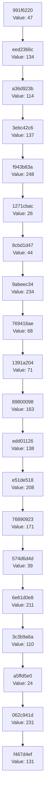

# Hash Chain Visualization

```mermaid
graph TD
    C0["f467d4ef<br/>Value: 131"]
    C1["062c941d<br/>Value: 231"]
    C1 --> C0
    C2["a5ffd5e0<br/>Value: 24"]
    C2 --> C1
    C3["3c3b9a6a<br/>Value: 110"]
    C3 --> C2
    C4["6e61d0e8<br/>Value: 211"]
    C4 --> C3
    C5["574d6d4d<br/>Value: 39"]
    C5 --> C4
    C6["76890923<br/>Value: 171"]
    C6 --> C5
    C7["e51de518<br/>Value: 208"]
    C7 --> C6
    C8["edd01126<br/>Value: 138"]
    C8 --> C7
    C9["89800098<br/>Value: 163"]
    C9 --> C8
    C10["1391a204<br/>Value: 71"]
    C10 --> C9
    C11["769416ae<br/>Value: 68"]
    C11 --> C10
    C12["9abeec34<br/>Value: 234"]
    C12 --> C11
    C13["8cbd1d47<br/>Value: 44"]
    C13 --> C12
    C14["1271cbac<br/>Value: 26"]
    C14 --> C13
    C15["f943b83a<br/>Value: 248"]
    C15 --> C14
    C16["3ebc42c6<br/>Value: 137"]
    C16 --> C15
    C17["a36d923b<br/>Value: 114"]
    C17 --> C16
    C18["eed2366c<br/>Value: 134"]
    C18 --> C17
    C19["991f6220<br/>Value: 47"]
    C19 --> C18
```