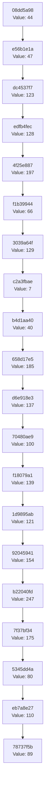

# Hash Chain Visualization

```mermaid
graph TD
    C0["78737f5b<br/>Value: 89"]
    C1["eb7a8e27<br/>Value: 110"]
    C1 --> C0
    C2["5345dd4a<br/>Value: 80"]
    C2 --> C1
    C3["7f37bf34<br/>Value: 175"]
    C3 --> C2
    C4["b22040fd<br/>Value: 247"]
    C4 --> C3
    C5["92045941<br/>Value: 154"]
    C5 --> C4
    C6["1d9895ab<br/>Value: 121"]
    C6 --> C5
    C7["f18079a1<br/>Value: 139"]
    C7 --> C6
    C8["70480ae9<br/>Value: 100"]
    C8 --> C7
    C9["d6e918e3<br/>Value: 137"]
    C9 --> C8
    C10["658d17e5<br/>Value: 185"]
    C10 --> C9
    C11["b4d1aa40<br/>Value: 40"]
    C11 --> C10
    C12["c2a3fbae<br/>Value: 7"]
    C12 --> C11
    C13["3039a64f<br/>Value: 129"]
    C13 --> C12
    C14["f1b39944<br/>Value: 66"]
    C14 --> C13
    C15["4f25e887<br/>Value: 197"]
    C15 --> C14
    C16["edfb4fec<br/>Value: 128"]
    C16 --> C15
    C17["dc4537f7<br/>Value: 123"]
    C17 --> C16
    C18["e56b1e1a<br/>Value: 47"]
    C18 --> C17
    C19["08dd5a98<br/>Value: 44"]
    C19 --> C18
```