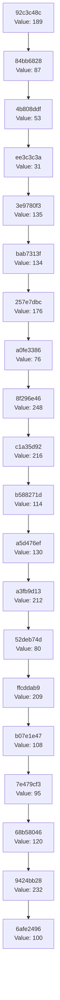

# Hash Chain Visualization

```mermaid
graph TD
    C0["6afe2496<br/>Value: 100"]
    C1["9424bb28<br/>Value: 232"]
    C1 --> C0
    C2["68b58046<br/>Value: 120"]
    C2 --> C1
    C3["7e479cf3<br/>Value: 95"]
    C3 --> C2
    C4["b07e1e47<br/>Value: 108"]
    C4 --> C3
    C5["ffcddab9<br/>Value: 209"]
    C5 --> C4
    C6["52deb74d<br/>Value: 80"]
    C6 --> C5
    C7["a3fb9d13<br/>Value: 212"]
    C7 --> C6
    C8["a5d476ef<br/>Value: 130"]
    C8 --> C7
    C9["b588271d<br/>Value: 114"]
    C9 --> C8
    C10["c1a35d92<br/>Value: 216"]
    C10 --> C9
    C11["8f296e46<br/>Value: 248"]
    C11 --> C10
    C12["a0fe3386<br/>Value: 76"]
    C12 --> C11
    C13["257e7dbc<br/>Value: 176"]
    C13 --> C12
    C14["bab7313f<br/>Value: 134"]
    C14 --> C13
    C15["3e9780f3<br/>Value: 135"]
    C15 --> C14
    C16["ee3c3c3a<br/>Value: 31"]
    C16 --> C15
    C17["4b808ddf<br/>Value: 53"]
    C17 --> C16
    C18["84bb6828<br/>Value: 87"]
    C18 --> C17
    C19["92c3c48c<br/>Value: 189"]
    C19 --> C18
```